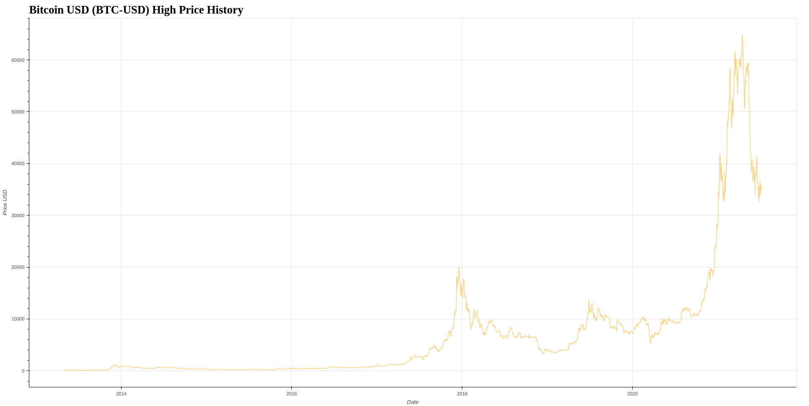

# Bokeh-graph

## Web application that I used
```
Jupyter Notebook
```

## Used Python library
```
1. pandas
2. Bokeh
```

## Source data:
```
[finance.yahoo.com](https://query1.finance.yahoo.com/v7/finance/download/BTC-USD?period1=1410912000&period2=1639958400&interval=1d&events=history&includeAdjustedClose=true)
```

## Images


## Instructions, how to display the graph
```
1. Downloads ZIP files
2. open Jupyter Notebook (from the same folder)
3. load "Bitcoin_graph_history.ipynb" and then press "Ctrl + ENTER"
```
